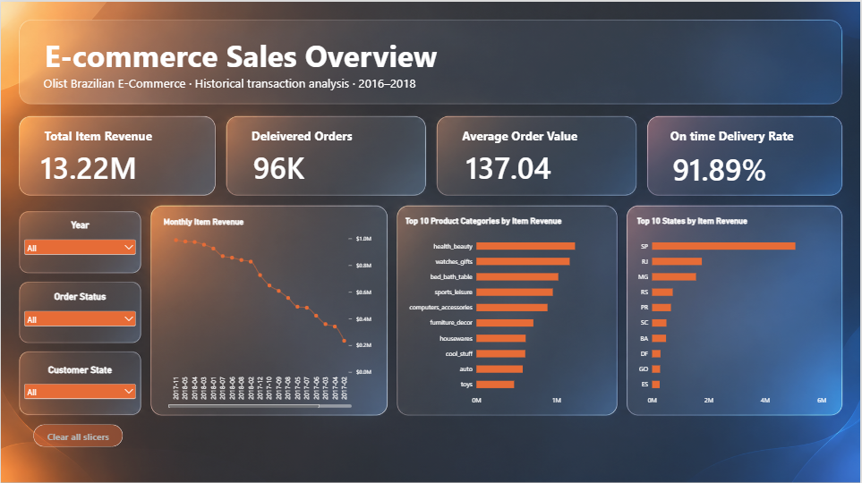

# E-commerce Customer Profitability \& Retention Intelligence


## Overview


An end-to-end data analytics project analyzing customer behavior,

revenue, customer value, and repeat purchasing in an e-commerce

marketplace.

## 📊 Power BI Dashboard




## 🔍 Key Findings

- Generated approximately **13.22M in item revenue** across the analyzed transactions.
- Analyzed approximately **96K delivered orders**.
- Average Order Value was approximately **137.04**.
- Overall on-time delivery rate was approximately **91.89%**.
- **Health & Beauty** was the highest-performing product category by item revenue.
- **São Paulo (SP)** generated the highest item revenue among Brazilian states.
- Delivery performance showed a relationship with customer review scores, highlighting the importance of timely fulfillment.
  
  

## 🔄 Analysis Workflow

```text
Raw Olist Dataset  
↓  
Data Quality Checks  
↓  
Data Cleaning & Preparation  
↓  
SQL Business Analysis  
↓  
Python EDA & Statistical Analysis  
↓  
Processed Analytical Tables  
↓  
Power BI Data Model  
↓  
Interactive Dashboard  
↓  
Business Insights & Recommendations

```


### Tools Used

| Area              | Tools                |
| ----------------- | -------------------- |
| Data Analysis     | Python, Pandas       |
| Database Analysis | PostgreSQL, SQL      |
| Statistics        | Python               |
| Visualization     | Power BI, Matplotlib |
| Data Preparation  | Pandas, Power Query  |
| Version Control   | Git, GitHub          |

## 📁 Project Structure

```text
Ecommerce-Customer-Analytics/  
│  
├── data/  
│ ├── raw/  
│ └── processed/  
│ └── powerbi/  
│  
├── docs/  
│ ├── business_findings.md  
│ ├── business_questions.md  
│ ├── data_dictionary.md  
│ ├── kpi_definitions.md  
│ └── python_eda_findings.md  
│  
├── images/  
│ ├── powerbi-sales-overview.png  
│ ├── delivery_delay_distribution.png  
│ ├── monthly_item_revenue.png  
│ ├── order_value_distribution.png  
│ ├── order_value_distribution_trimmed.png  
│ ├── review_scores_by_delivery_delay.png  
│ ├── top_categories.png  
│ └── top_states.png  
│  
├── powerBI/  
│ └── E-commerce Sales Overview.pbix  
│  
├── python/  
│ ├── 01_data_quality.ipynb  
│ └── 02_eda.ipynb  
│  
├── sql/  
│ ├── 01_import_validation.sql  
│ ├── 02_basic_exploration.sql  
│ ├── 03_monthly_sales_analysis.sql  
│ ├── 04_category_performance.sql  
│ ├── 05_seller_performance.sql  
│ ├── 06_average_order_value.sql  
│ ├── 07_customer_retention.sql  
│ └── 08_delivery_performance.sql  
│  
├── .gitignore  
└── README.md

```

## Business Problem


The objective is to understand which customer behaviors and segments

are associated with higher customer value and repeat purchasing, and

translate the findings into actionable business recommendations.


## Tools


\- SQL

\- PostgreSQL

\- Python

\- Pandas

\- Statistics

\- Power BI

\- Git/GitHub


## Dataset


Brazilian E-Commerce Public Dataset by Olist.


The dataset contains approximately 100,000 orders from 2016–2018

and includes customer, order, product, seller, payment, review,

and delivery information.


## Project Status


🚧 In Progress


## Key Questions


\- Who are the most valuable customers?

\- What proportion of customers make repeat purchases?

\- How quickly do customers return?

\- Which customer segments have the highest value?

\- How does retention vary across cohorts?

\- What behaviors are associated with repeat purchasing?


## Project Structure

data/

sql/

python/

powerbi/

docs/

images/


## 📊 Dataset

This project uses the **Brazilian E-Commerce Public Dataset by Olist**, a public e-commerce dataset containing approximately 100,000 orders from 2016–2018.

The dataset includes information about:

- Customers
- Orders
- Order items
- Payments
- Reviews
- Products
- Sellers
- Geolocation

### Data Source

The dataset was obtained from **Kaggle**.

The original dataset files are **not included in this repository**. They are kept locally because the dataset is subject to its original license terms.

### License

The dataset is licensed under:

**Creative Commons Attribution-NonCommercial-ShareAlike 4.0 International (CC BY-NC-SA 4.0)**

[View License](https://creativecommons.org/licenses/by-nc-sa/4.0/)

## 📚 Documentation & Analysis

### Business Analysis

- [Business Questions](docs/business_questions.md)
- [KPI Definitions](docs/kpi_definitions.md)
- [Business Findings](docs/business_findings.md)
- [Data Dictionary](docs/data_dictionary.md)

### SQL Analysis

The `sql/` directory contains SQL scripts covering:

- Data import and validation
- Basic data exploration
- Monthly sales analysis
- Category performance
- Seller performance
- Average Order Value
- Customer retention
- Delivery performance

### Python Analysis

The `python/` directory contains Jupyter notebooks covering:

- Data quality validation
- Exploratory Data Analysis (EDA)
- Customer and sales analysis
- Statistical exploration
- Visualization

### Power BI

The `powerBI/` directory contains the Power BI dashboard used for interactive business analysis.


## Data Model


The project uses the Brazilian E-Commerce Public Dataset by Olist,

which contains multiple related tables covering customers, orders,

order items, payments, reviews, products, and sellers.


The primary analytical entities are:


\- Customers

\- Orders

\- Order Items

\- Products

\- Payments

\- Reviews

\- Sellers


A key modeling consideration is the distinction between order-level

and order-item-level grain. This prevents double-counting when

joining transactional tables.


* Data cleaning and validation with pandas.

* Order-level analytical table created by aggregating item, payment and review data.

* Exploratory analysis of sales, customer segments, categories, sellers, delivery and reviews.

* Exported datasets stored in `data/processed/powerbi/`.

* Visualisations stored in `images/`.

* Findings documented in `docs/python_eda_findings.md`.
